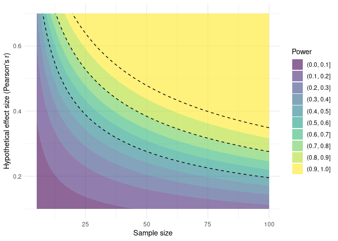
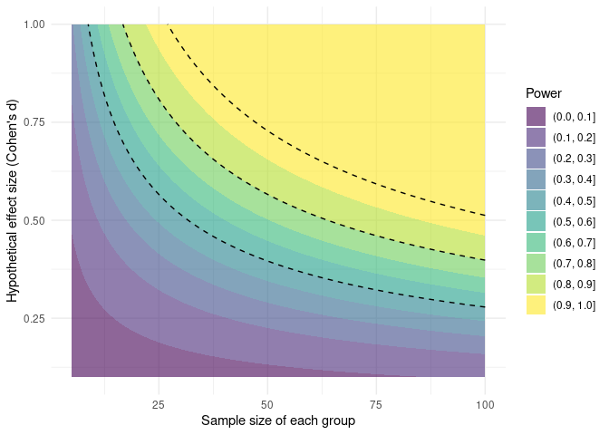
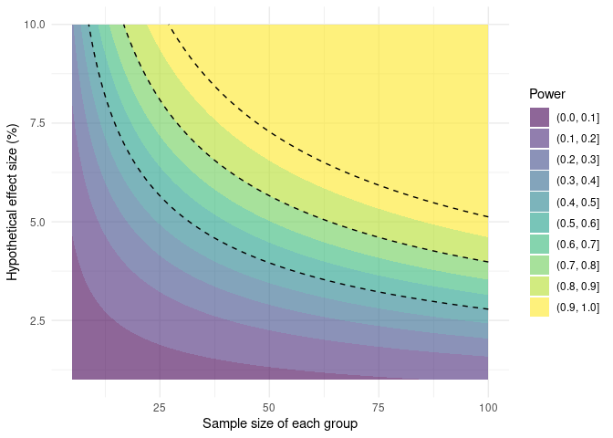

<!-- README.md is generated from README.Rmd. Please edit that file -->

# pwrcontour

<!-- badges: start -->

<!-- badges: end -->

The goal of pwrcontour is to present power analyses in which it is
possible to evaluate power for numerous hypothetical effect sizes at
once. This makes it easier to communicate the fact that power is a
calibration for different potential contingencies of the true size of
the effect of interest. This is based on the tables and figures created
by Richard Morey in the jamovi jpower module.

This package is still in alpha, and more features will likely be added
at a later point.

## Installation

You can install the released version of pwrcontour from Github with:

``` r
remotes::install_github("mathesong/pwrcontour")
```

## Example

The main functions are simply for plotting power contours, or examining
power tables, based around the syntax of the functions in the `pwr`
package.

### Correlations

``` r
library(pwrcontour)
pwr.r.test.contour(5, 100, 0.1, 0.7)
```



``` r
pwr.r.test.table(25)
```

| True Effect Size (Pearson’s r) | Power to detect | Description            |
| :----------------------------: | :-------------: | :--------------------- |
|           r \< 0.389           |     \< 50%      | Likely miss            |
|      0.389 \< r \< 0.528       |    50% - 80%    | Good chance of missing |
|      0.528 \< r \< 0.639       |    80% - 95%    | Probably detect        |
|           r \> 0.639           |     \> 95%      | Almost surely detect   |

Power by effect size

### T-tests

``` r
pwr.t.test.contour(5, 100, 0.1, 1)
```



``` r
pwr.t.test.table(25)
```

| True Effect Size (Cohen’s d) | Power to detect | Description            |
| :--------------------------: | :-------------: | :--------------------- |
|        delta \< 0.566        |     \< 50%      | Likely miss            |
|   0.566 \< delta \< 0.809    |    50% - 80%    | Good chance of missing |
|   0.809 \< delta \< 1.041    |    80% - 95%    | Probably detect        |
|        delta \> 1.041        |     \> 95%      | Almost surely detect   |

Power by effect size

The package also makes it possible to present these figures in the raw
units of analysis. For example, if we calculate that a 10% change is
equivalent to a Cohen’s d of 1, we can incorporate this into the figures
or tables.

``` r
pwr.t.test.contour(5, 100, 1, 10, d_unitconversion = 10, d_units = "%")
```



``` r
pwr.t.test.table(25, d_unitconversion = 10, d_units = "%")
```

|   True Effect Size (%)   | Power to detect | Description            |
| :----------------------: | :-------------: | :--------------------- |
|      delta \< 5.656      |     \< 50%      | Likely miss            |
| 5.656 \< delta \< 8.087  |    50% - 80%    | Good chance of missing |
| 8.087 \< delta \< 10.407 |    80% - 95%    | Probably detect        |
|     delta \> 10.407      |     \> 95%      | Almost surely detect   |

Power by effect size
